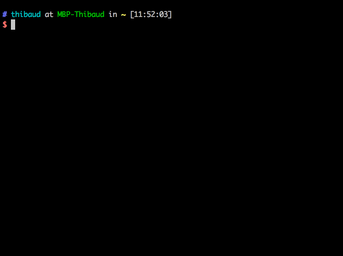

# dotfiles [](https://travis-ci.org/thibaudcolas/dotfiles)

```txt
       ██            ██     ████ ██  ██
      ░██           ░██    ░██░ ░░  ░██
      ░██  ██████  ██████ ██████ ██ ░██  █████   ██████
  ██████ ██░░░░██░░░██░ ░░░██░ ░██ ░██ ██░░░██ ██░░░░
 ██░░░██░██   ░██  ░██    ░██  ░██ ░██░███████░░█████
░██  ░██░██   ░██  ░██    ░██  ░██ ░██░██░░░░  ░░░░░██
░░██████░░██████   ░░██   ░██  ░██ ███░░██████ ██████

  ▓▓▓▓▓▓▓▓▓▓▓▓▓▓▓▓▓▓▓▓▓▓▓▓▓▓▓▓▓▓▓▓▓▓▓▓▓▓▓▓▓▓▓▓▓▓▓▓▓▓▓▓▓▓▓▓▓▓▓▓▓▓▓
 ░▓ Software Installation, Configuration and Preferences for    ▓
 ░▓ https://github.com/thibaudcolas/dotfiles                    ▓
 ░▓▓▓▓▓▓▓▓▓▓▓▓▓▓▓▓▓▓▓▓▓▓▓▓▓▓▓▓▓▓▓▓▓▓▓▓▓▓▓▓▓▓▓▓▓▓▓▓▓▓▓▓▓▓▓▓▓▓▓▓▓▓▓
```

## Setting up your new Mac `(◕‿◕)`

> The goal is to automate **80%** of the setup of your new computer.

* Download a [ZIP of this repository](https://github.com/thibaudcolas/dotfiles/archive/master.zip).
* Unzip the file if necessary. You should have a `dotfiles-master` folder in your `Downloads` folder.
* Launch the Terminal app, found in `/Applications/Utilities/`
* Copy and paste the following line into the Terminal, and press `Enter`:

```bash
cd ~/Downloads/dotfiles-master && ./install.sh
```

The installation process should start, and ask you questions. You'll also be asked to enter your password from time to time. **If this is your first run on a fresh Mac, you'll have to start it again after the first install.**



## Going further

| :book:                                                                        |
| ----------------------------------------------------------------------------- |
| [Command-line](#command-line)                                                 |
| [Fonts](#fonts)                                                               |
| [macOS Preferences](#macos-preferences)                                       |
| [Alfred workflows (requires Powerpack)](#alfred-workflows-requires-powerpack) |
| [Sublime Text configuration](#sublime-text-3)                                 |
| [Visual Studio Code configuration](/config/visual-studio-code/)               |
| [Extra documentation: `docs/`](docs/)                                         |

### Fonts

```bash
cd ~/Downloads/dotfiles-master && ./fonts.sh
```

### Command-line

> This section requires some command-line knowledge.

Requires `brew`. The first group of tools contains `node`, `ruby` & `python` which are required to install the second group of tools.

```bash
cd ~/Downloads/dotfiles-master && ./cli.sh
```

While you're waiting for this to finish, go [generate your SSH keys](https://help.github.com/articles/generating-ssh-keys/) for GitHub and beyond.

After that, head over to http://brewformulas.org/ to find other things that you might like!

#### Shell pimping

Have a look at https://github.com/robbyrussell/oh-my-zsh, then:

* Grab a terminal theme from https://github.com/mbadolato/iTerm2-Color-Schemes.
* Grab Powerline fonts https://github.com/powerline/fonts.

Grab a zsh prompt theme from:

* https://github.com/denysdovhan/spaceship-zsh-theme
* https://github.com/caiogondim/bullet-train.zsh
* https://github.com/bhilburn/powerlevel9k

#### Dotfiles

The `dotfiles` subfolder contains configuration for all things CLI. Have a look, peek around, use what you like.

### macOS Preferences

You can set macOS preferences by using [osx-for-hackers.sh](https://gist.github.com/brandonb927/3195465). Beware, this can be dangerous!

When setting up a new Mac, you may want to set some sensible defaults:

```bash
./macos.sh
```

### Apps configuration

> This section requires some command-line knowledge.

[Mackup](https://github.com/lra/mackup) is awesome. It uses Dropbox / Google Drive / Copy & Paste to backup your configuration for:

```txt
1Password 4, Ack, Adium, Adobe Camera Raw, Adobe Lightroom, AppCode, aria2c, Arara, Artistic Style, Arm, asciinema, Aspell, Atom, AusKey, Autokey, Awareness, AWS Command Line Interface, Microsoft Azure CLI, Bartender, Bash it, Bash, BetterSnapTool, BetterTouchTool, BibDesk, Billings Pro Server Admin, Bitchx, Boto, Brackets, Bundler, Byobu, Caffeine, Cartographica, Charles, Chef, Chicken, Clementine, ClipMenu, CloudApp, Coda 2... and more
```

... so that you can forget about reconfiguring everything. Give it a look.

### Alfred workflows (requires Powerpack)

Have a look at:

* https://github.com/zenorocha/alfred-workflows
* https://github.com/willfarrell/alfred-workflows

## Software configuration

### Visual Studio Code

Have a look at our resources in [`config/visual-studio-code`](config/visual-studio-code).

### Sublime Text 3

> You will need [Package Control](https://packagecontrol.io/). You may also need a nice font, like [Source Code Pro](https://github.com/adobe-fonts/source-code-pro).

Have a look at the default configuration and the list of packages in [`config/sublime`](config/sublime).

To install the packages, open your Command Palette _(Cmd+Maj+P)_, type `Browse packages` and go edit the file `Packages/User/Package Control.sublime-settings`. Save the file, and restart Sublime Text.

Once this is all done, you will want to use Babel Sublime for your JavaScript syntax highlighting. [Here's how to](https://github.com/babel/babel-sublime#setting-as-the-default-syntax).

## Contributing to this project

If you want to tinker with the bash scripts, please install [ShellCheck](https://github.com/koalaman/shellcheck) and use it to check your changes.

```bash
# Debian distribs
apt-get install shellcheck
# OSX
brew install shellcheck

shellcheck *.sh

# Its output should be empty:
# $ shellcheck *.sh | wc -l
#        0
```

## See also

* http://brew.sh/
* http://caskroom.io/
* https://dotfiles.github.io/
* http://lapwinglabs.com/blog/hacker-guide-to-setting-up-your-mac
* https://github.com/ptb/mac-setup

## Credits

* Actual dotfiles originally from https://github.com/mathiasbynens/dotfiles
* Dotfiles lib from https://github.com/atomantic/dotfiles
* ASCII Art from https://github.com/xero/dotfiles
* ASCII faces from https://github.com/maxogden/cool-ascii-faces

## Manual tasks

### Installs

* [Transmission](https://transmissionbt.com/)
* [Geotag](http://geotag.sourceforge.net/)
* [Soundflower](https://github.com/mattingalls/Soundflower)
* From App Store: Pages, Keynotes, Numbers

### Manual configuration

* iTunes
* Dropbox
* Notification center widgets
* Internet accounts
* VS Code
* Licenses
* Dictionnaries - `File > Open Dictionaries Folder`.
* `/etc/hosts`
* iTerm2 – "Load preferences from a custom folder or URL:" `/Users/thibaud/Dropbox/Sync/iTerm2`.

### Chrome extensions

* [Hangouts](https://chrome.google.com/webstore/detail/google-hangouts/nckgahadagoaajjgafhacjanaoiihapd?hl=en-US)
* [The Great Suspender](https://chrome.google.com/webstore/detail/the-great-suspender/klbibkeccnjlkjkiokjodocebajanakg?hl=en-US)
* [Copy all URLs](https://chrome.google.com/webstore/detail/copy-all-urls/djdmadneanknadilpjiknlnanaolmbfk?hl=en-US)
* [React DevTools](https://chrome.google.com/webstore/detail/react-developer-tools/fmkadmapgofadopljbjfkapdkoienihi?hl=en-US)
* [Redux DevTools](https://chrome.google.com/webstore/detail/redux-devtools/lmhkpmbekcpmknklioeibfkpmmfibljd?hl=en-US)
* [Browserstack](https://chrome.google.com/webstore/detail/browserstack/nkihdmlheodkdfojglpcjjmioefjahjb?hl=en)
* [uBlock Origin](https://github.com/gorhill/uBlock)
* [Google Docs Offline](https://chrome.google.com/webstore/detail/google-docs-offline/ghbmnnjooekpmoecnnnilnnbdlolhkhi)
* [Fauxbar Lite](https://chrome.google.com/webstore/detail/fauxbar-lite/bfimmnpbjccjihohjkimphfmmebffbmk)
* [JSONView](https://chrome.google.com/webstore/detail/jsonview/chklaanhfefbnpoihckbnefhakgolnmc)
* [OctoLinker](https://chrome.google.com/webstore/detail/octolinker/jlmafbaeoofdegohdhinkhilhclaklkp)
